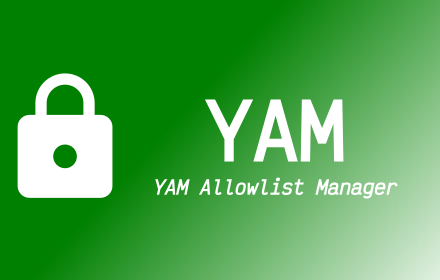
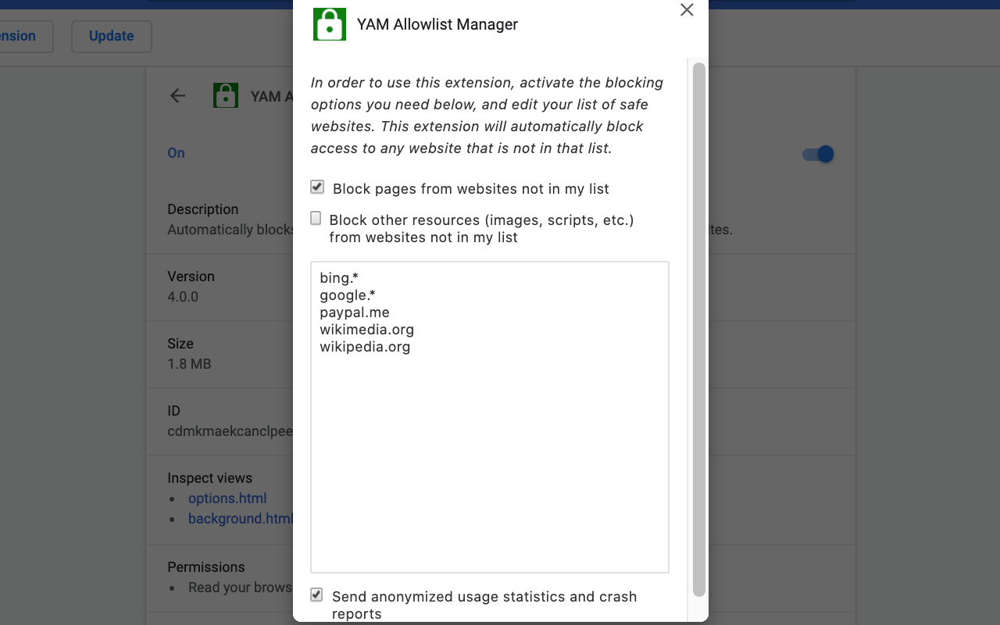
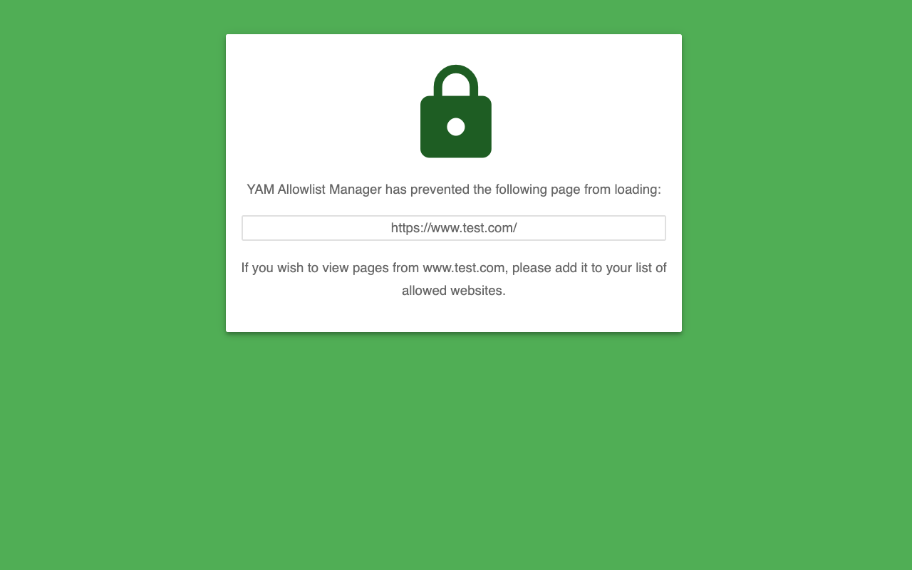

# YAM Allowlist Manager

Automatically blocks all pages from any website that is not in your list of allowed websites.  

 

## Description

Do you have small children, and need to limit the pages they visit to a few known safe websites? Or maybe you just want to concentrate and eliminate all distractions? Then YAM is for you!

Create your own _allowlist_ of safe websites, and YAM will automatically block all pages from any other website that is not in that list.

When installing _YAM Allowlist Manager_, your browser will warn you that YAM can access your data on all sites, and your browsing history. These permissions are required to block pages when you are browsing. No information is stored on your computer and no personal data is obtained from this extension. I promise!

## Installation

Go to the [YAM page](https://chrome.google.com/extensions/detail/aeepebmcdnjkjobnhfagojgfonkappej) on the Chrome Web Store and hit the _Add to Chrome_ button.

## Usage

In Chrome, the _allowlist_ will synchronize across multiple devices.  If you are logged into Chrome with your child's account, you can add or modify entries in the _allowlist_ and they will synchronize in near real-time.  This might work on other browsers as well, but I have not tested them.

When adding a website to your _allowlist_, consider the following:

  * You can use wildcards. For example, if you add _google.\*_, you WILL be able to access _google.com_, _google.de_, _google.es_, etc.
  * If you only specify the domain of the website, its subdomains will also be allowed. That is, if you add _google.com_, you WILL be able to access _mail.google.com_, _maps.google.com_, etc.
  * If you specify both the domain and the subdomain of the website, only that subdomain will be allowed. That is, if you add _www.google.com_, you WILL NOT be able to access _mail.google.com_, _maps.google.com_, etc.
  * Putting `;` in front of an entry in the _allowlist_ is an easy way to temporarily block a site.  When you want that site to be accessible again, simply remove the `;`.  Spaces, or any other character that won't match the real site, would also work.

## Contributors

This project originally forked from [whitelist-manager](https://github.com/unindented/whitelist-manager).  I created this fork due to [privacy concerns](https://github.com/unindented/whitelist-manager/issues/225) after the original extension was sold to a third party.

* Daniel Perez Alvarez ([unindented@gmail.com](mailto:unindented@gmail.com))
* David Moreno Gomez ([dmgomez@gmail.com](mailto:dmgomez@gmail.com))

## License

Copyright (c) 2016 Daniel Perez Alvarez ([unindented.org](https://unindented.org/)). This is free software, and may be redistributed under the terms specified in the LICENSE file.
